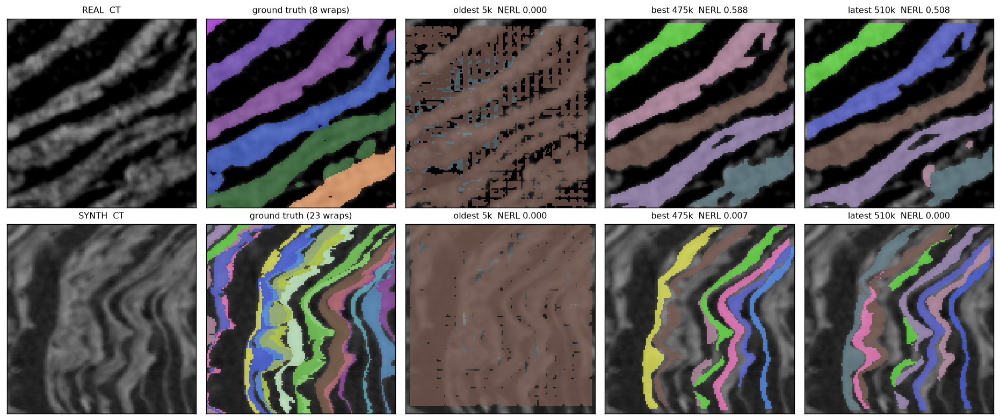
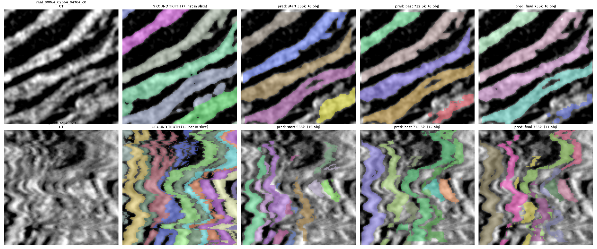

<div align="center">

# Flood-Fill Network (FFN) for Scroll Sheet Segmentation

[](https://huggingface.co/nestorvfx/FFN_Models)
[](https://huggingface.co/datasets/nestorvfx/Pregenerated_Synth_Dataset)
[](https://opensource.org/licenses/MIT)

<table>
  <tr>
    <td align="center"></td>
    <td align="center"></td>
  </tr>
</table>

</div>

## Overview

This repository provides an experimental 3D Flood-Fill Network (FFN) pipeline for instance-segmenting papyrus sheets in CT volumes of the Herculaneum scrolls. The primary deliverables provided here are:

1. **The Trained FFN Model**: A 3D ResNet that attempts to grow sheets one at a time from a medial-axis seed.
2. **The Training Pipeline Infrastructure**: Distributed data parallel (DDP) training scripts and evaluation tools.
3. **The Synthetic Dataset Generation Infrastructure**: A pipeline for generating synthetic datasets by extracting real sheet data and fusing it into new configurations.
4. **Pre-Generated Datasets & Checkpoints**: Hosted on Hugging Face for immediate use (see links below).

**Development Note**: This project was iterated upon with the assistance of artificial intelligence. The core deliverables are provided as functional baselines, while the supporting documents (`DESIGN.md`, `FINDINGS.md`) are included for historical context and may contain obsolete references.

---

## The Synthetic Dataset

The synthetic dataset generation pipeline (`synth/`) was created to provide data for the network to train on. It works by taking isolated sheets from real CT data, extracting them, and fusing them together to create synthetic volumes with known labels. If you want to understand the exact mechanics of how this works, you can read the files within the `synth/` directory.

## What is on Hugging Face?

All assets are pre-packaged on the Hugging Face Hub (publicly accessible, no token required):

1. **[Dataset Repo](https://huggingface.co/datasets/nestorvfx/Pregenerated_Synth_Dataset)**: Contains the synthetic training corpus, real harmonized crops, and a held-out evaluation slab.
2. **[Models Repo](https://huggingface.co/nestorvfx/FFN_Models)**: Contains the historical checkpoints from various training runs.

**Best Checkpoint**: 
The recommended checkpoint for inference and further exploration is **`ffn_run6/ckpt_core_best.pt`**.

## How to Train & Run (Quick Start)

To set up the environment and start a training job:

```bash
# 1. Setup environment and download pre-generated data from HF
# (HF_TOKEN is optional. If omitted, it will download anonymously).
bash scripts/bootstrap.sh

# 2. Start DDP Training
nohup torchrun --nproc_per_node=2 -m scripts.train \
  --work /root/surf/ffn_run \
  --tracer \
  --core-dirs /root/data/evalcubes/Scroll3EvalCubes,/root/data/evalcubes/Scroll4EvalCubes \
  > /root/surf/ffn_run/train.log 2>&1 &

# (Optional) To resume from an existing checkpoint:
RESUME=1 bash scripts/bootstrap.sh
```

## Evaluation

You can run the evaluation scripts using the provided gates:

```bash
# Gate A (Panel of held-out real and synthetic cubes)
python -m scripts.evaluate --gate A --work /root/surf/ffn_run --ckpt /root/surf/ffn_run/ckpt_core_best.pt

# Gate B (Held-out real scroll slab)
python -m scripts.evaluate --gate B --work /root/surf/ffn_run --ckpt /root/surf/ffn_run/ckpt_core_best.pt --slab /root/data/slab
```

## How to Generate the Dataset Yourself

If you prefer to generate the synthetic dataset yourself instead of downloading the pre-generated ones:

```bash
cd synth
# 1. Cache isolated donor sheets
python preharvest.py
# 2. Filter invalid donor sheets
python donor_screen.py
# 3. Generate the fused 3D synthetic corpus
python gen_corpus2.py --jobs 64
```
Once generated, `scripts/preprocess.py` indexes it for the FFN dataloader.

## Directory Structure

* `ffn/` — Core FFN deep learning library.
* `tracer/` — Wrap-period estimation and spatial dependencies.
* `synth/` — Synthetic data generator.
* `scripts/` — Pipeline CLI (bootstrap, train, evaluate, ingest).
* `visuals/` — Rendered comparisons and tracing progression.
* `DESIGN.md` & `FINDINGS.md` — Extended supporting documentation (see AI iteration note above).
